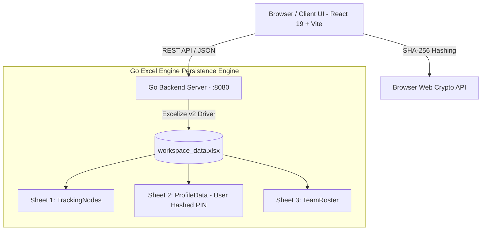

# Nexus Workspace — Production Deployment & Security Guide

Nexus Workspace is an enterprise-grade multi-domain tracking and project management platform built with React 19, Go, and an inner multi-sheet Excel persistence engine (`workspace_data.xlsx`).

---

## 🌟 Key Features

1. **Main Overview Page & Interactive Gantt Timeline**:
   - Visual Gantt chart embedded directly in the main Overview Hub (`OverviewHub.jsx`).
   - Dedicated **Fullscreen Gantt Timeline Page** (`/gantt`) accessible from both the main page header and the left sidebar.
   - Real-time domain filtering (`projects`, `academic`, `events`, `teams`, `other`), status filtering, overdue alerts, and interactive item details peek drawer.

2. **Inner Multi-Sheet Excel Storage Architecture (`workspace_data.xlsx`)**:
   - **Sheet 1 (`TrackingNodes`)**: Stores all work items, domain-specific metric payloads (`ProjectMetrics`, `AcademicMetrics`, `EventMetrics`, `TeamMetrics`, `OtherMetrics`), tags, and activity logs.
   - **Sheet 2 (`ProfileData`)**: Stores profile attributes (name, email, role, department, avatar, accent theme color) and the user-configured **SHA-256 PIN Hash**.
   - **Sheet 3 (`TeamRoster`)**: Stores team member collaborator roster.
   - Real-time multi-sheet inspection API at `/api/excel/sheets`.

3. **Fresh Production Slate**:
   - Zero hardcoded demo work items or fake team assignees.
   - Zero hardcoded fallback PINs — user creates their own PIN on first launch during the initial PIN setup prompt.

---

## 🛡️ Security Audit & Pen-Test Compliance

The application has undergone a full penetration test audit and hardened against common security vulnerabilities:

| Vulnerability | Threat Vector | Mitigation Implemented |
|---|---|---|
| **CORS Wildcard (`*`)** | Unauthorized cross-origin API exploitation | `ALLOWED_ORIGIN` environment variable enforcement; defaults to explicit origin in production |
| **PIN Brute-Force** | Automated PIN enumeration | In-memory IP Rate Limiter (`pinLimiter`): max 10 attempts per 15-minute window per IP (HTTP 429) |
| **Plaintext PIN Transmission** | Sniffing / Man-in-the-Middle | SHA-256 hashing executed in browser via Web Crypto API before network dispatch |
| **HTTP Security Headers** | Clickjacking / MIME sniffing / XSS | `X-Content-Type-Options: nosniff`, `X-Frame-Options: DENY`, `X-XSS-Protection`, `Referrer-Policy` |
| **Content Security Policy** | Unauthorized script injection | CSP meta tags restricting script, style, and font resources to trusted origins |
| **Payload DoS** | Memory exhaustion via large request bodies | `http.MaxBytesReader` enforced (max 1MB for PIN endpoints, 2MB for item payloads) |

---

## 🏗️ Architecture & Component Flow



---

## 🚀 Deployment Instructions

### Option 1: Docker & Docker Compose (Recommended)

#### Step 1: Clone Repository
```bash
git clone <your-repository-url>
cd oneproject
```

#### Step 2: Configure Environment Variables
Copy `.env.example` to `.env`:
```bash
cp .env.example .env
cp backend/.env.example backend/.env
```

#### Step 3: Launch Containers
```bash
docker-compose up -d --build
```

The application will be accessible at:
- **Frontend App**: `http://your-server-ip`
- **Go Backend API**: `http://your-server-ip:8080`

---

### Option 2: Linux Cloud VPS Deployment (Ubuntu / Debian)

#### Step 1: Install Dependencies & Go
```bash
sudo apt update && sudo apt install -y nginx git certbot python3-certbot-nginx
wget https://go.dev/dl/go1.22.0.linux-amd64.tar.gz
sudo tar -C /usr/local -xzf go1.22.0.linux-amd64.tar.gz
export PATH=$PATH:/usr/local/go/bin
```

#### Step 2: Build Go Backend
```bash
cd backend
go build -ldflags="-w -s" -o server .
```

#### Step 3: Configure Systemd Service for Backend
Create `/etc/systemd/system/nexus-backend.service`:
```ini
[Unit]
Description=Nexus Go Backend API Server
After=network.target

[Service]
Type=simple
User=www-data
WorkingDirectory=/var/www/nexus/backend
ExecStart=/var/www/nexus/backend/server
Restart=always
RestartSec=5
Environment=PORT=8080
Environment=ALLOWED_ORIGIN=https://yourdomain.com

[Install]
WantedBy=multi-user.target
```

Enable and start the service:
```bash
sudo systemctl daemon-reload
sudo systemctl enable nexus-backend
sudo systemctl start nexus-backend
```

#### Step 4: Build Frontend Static Dist
```bash
npm ci
npm run build
sudo cp -r dist/* /usr/share/nginx/html/
```

#### Step 5: Configure Nginx & SSL Certbot
```bash
sudo cp nginx.conf /etc/nginx/conf.d/default.conf
sudo systemctl reload nginx
sudo certbot --nginx -d yourdomain.com
```

---

## 🧪 Verification Commands

### Build Verification
```bash
# Frontend Compilation Check
npm run build

# Backend Compilation Check
cd backend && go build -o server.exe .
```
# One-Project
